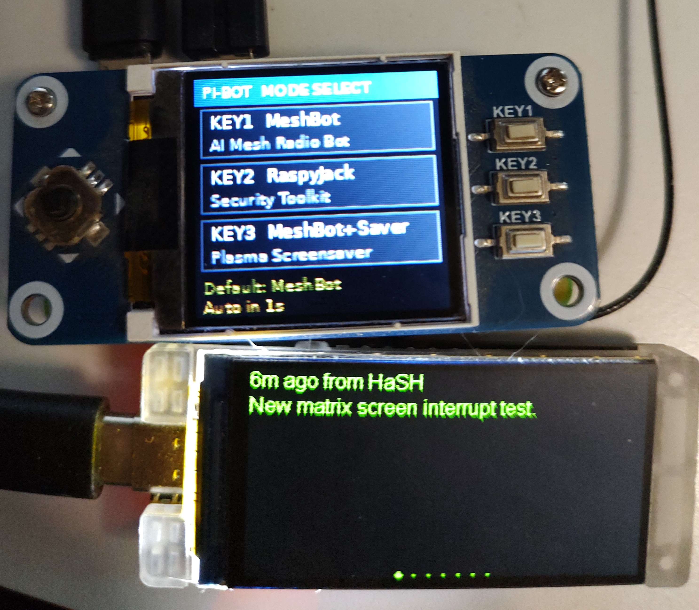
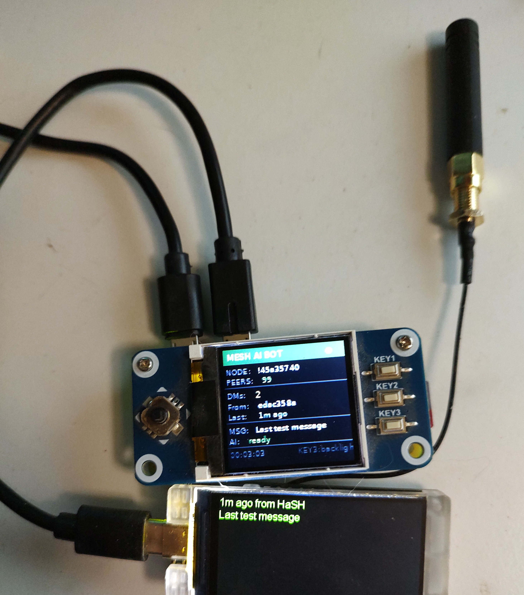
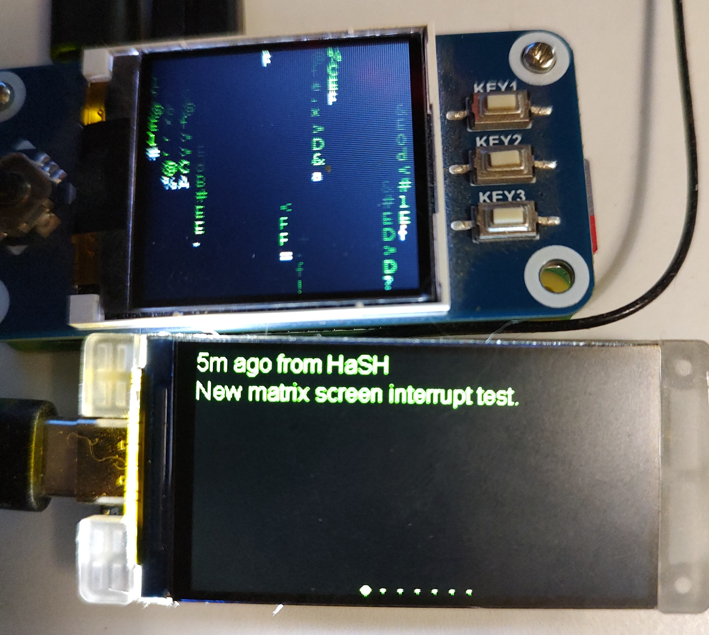
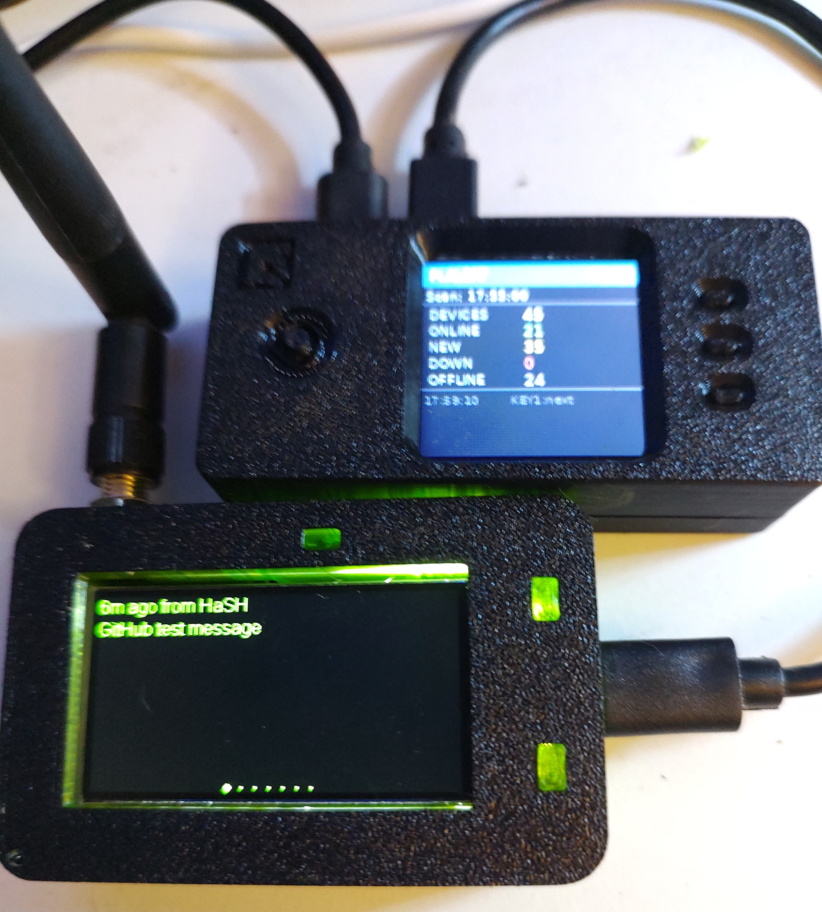
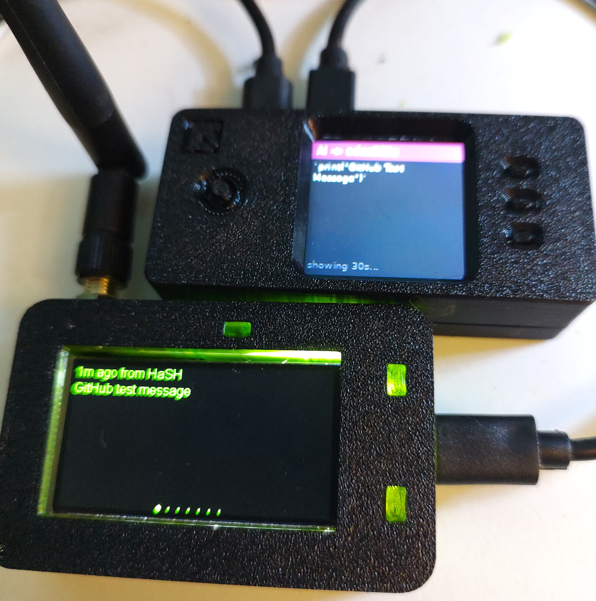
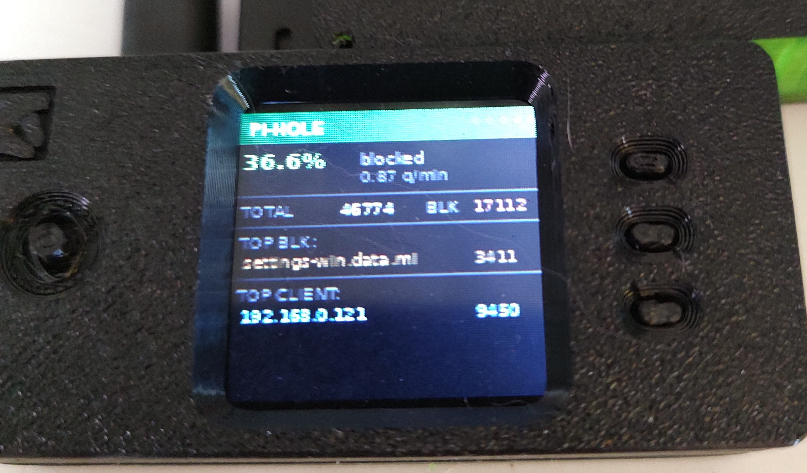
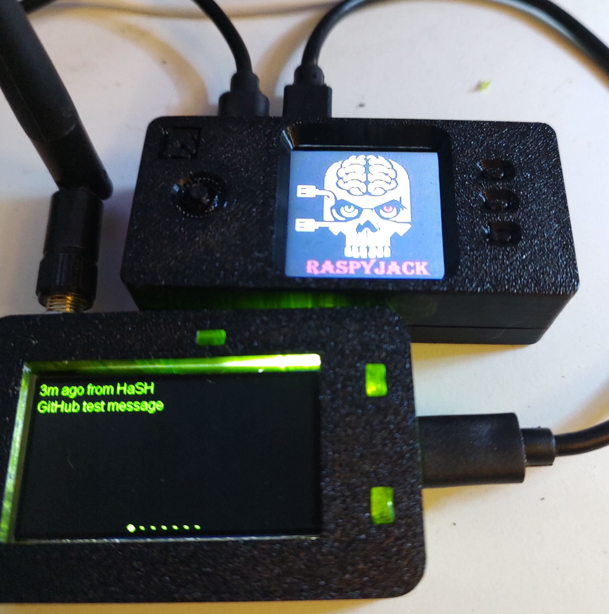
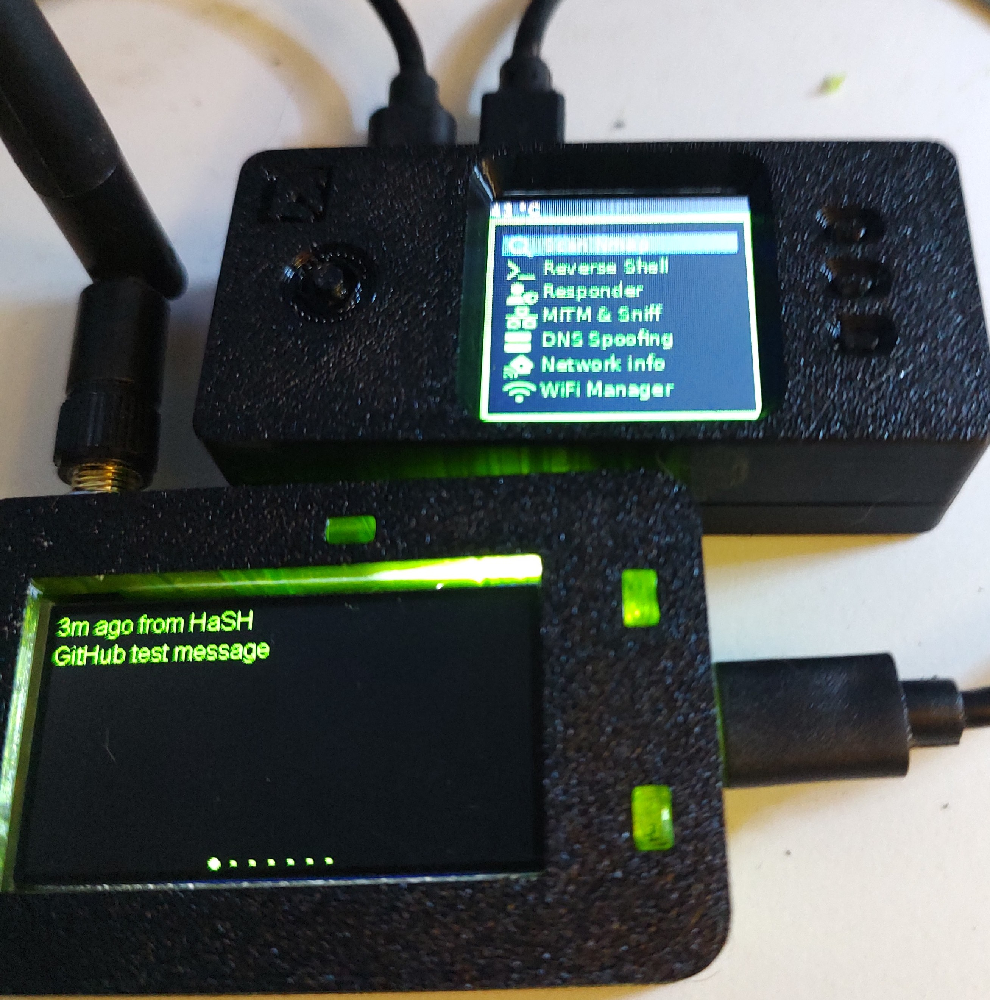

# RaspyMeshBot 2.0
## Key Features

- 🤖 **MeshBot for Meshtastic** — Groq-powered DM replies plus a lively open-mesh personality with canned greetings, test acknowledgments, cryptic replies, and scheduled check-ins
- 📡 **Multi-mode boot selector** on Waveshare LCD HAT
- 🛜 **Pi.Alert network monitoring** with ARP, new device, and WiFi anomaly detection
- 🧱 **Pi-hole DNS analytics** with query stats and spike detection
- 📬 **Mesh-based alerting** — sends anomaly alerts via Meshtastic DM
- 📻 **Scheduled open-mesh check-ins** — optional random test broadcasts between 8am and 8pm local time, at least 3 days apart
- 🌡️ **Telemetry monitor** — watches a Meshtastic sensor node (BME680 or similar) and DMs you when temperature or humidity thresholds are crossed
- 📺 **CYD companion display** — ESP32 "Cheap Yellow Display" shows bot DM replies full-screen with a PuTTY-style multi-color terminal palette; touch to navigate messages; auto-jumps to newest on arrival
- 🖥 **Live LCD dashboard** with Pi.Alert views, matrix rain, NWS forecast, and TX/RX message history
- 🔐 **Optional RaspyJack security toolkit mode**
- ⚙ **Built-in web settings portal** — configure everything from a browser
- 🔁 **ARP baseline reset** — long-press the CYD display to re-anchor the ARP monitor after network changes
- 🌐 **IP forward management** — persistent `ip_forward` setting survives reboots; MITM and RaspyJack auto-manage it

A Raspberry Pi Zero 2 W project centered around a **Meshtastic meshbot** with Groq-powered DM replies, an active open-mesh personality, and a **3-mode boot selector** on a Waveshare 1.44" LCD HAT.

Boot the Pi, pick your mode on the screen with a button press. Press the **joystick** at any time to open the built-in **web settings portal** — no SSH or manual config file editing needed.

---

## Photos

### UI Screenshots

| Boot Selector | MeshBot Status | Matrix Rain Interrupted |
|:---:|:---:|:---:|
|  |  |  |
| *3-mode menu on boot — press a key to launch, joystick to open Settings* | *Live status: node ID, peer count, DMs, last sender* | *Matrix rain pauses when a mesh message arrives* |

### Hardware (pre-case)

| Mode Selector + T190 | MeshBot + T190 | Matrix Rain + T190 |
|:---:|:---:|:---:|
|  |  |  |
| *Boot selector — also showing T190 with last received message* | *MeshBot status: 99 peers, 2 DMs, AI ready* | *Matrix rain as a selectable KEY3 view* |

### In the Printed Case

| Pi.Alert Dashboard (Mode 3) | AI Bot Reply (Mode 3) | Pi-hole Stats (Mode 3) |
|:---:|:---:|:---:|
|  |  |  |
| *Pi.Alert live view: 48 devices, 21 online, 35 new — KEY1 cycles views* | *AI bot DM reply displayed on screen for 30 seconds* | *Pi-hole stats: 36.6% blocked, 46k total queries, top blocked domain + top DNS client* |

| RaspyJack Splash (Mode 2) | RaspyJack Menu (Mode 2) |
|:---:|:---:|
|  |  |
| *RaspyJack loading — the T190 still shows the last mesh message received* | *RaspyJack security toolkit menu: Reverse Shell, Responder, MITM, DNS Spoofing and more* |

---
Note: RaspyJack requires an Ethernet hat and WiFi dongle for full features. Installation is optional. 
## Modes

| Key | Mode | What it does |
|-----|------|-------------|
| KEY1 | **MeshBot** | DM AI bot + open-mesh canned replies with live status screen |
| KEY2 | **RaspyJack** | Security toolkit (separate install — see below) |
| KEY3 | **Pi.Alert Multi-View** | Live network security dashboard + Pi-hole + Matrix + NWS forecast + message log |
| Joystick ↑ | **Bettercap** | Passive network recon — maps every device on your LAN + web dashboard at `:8082` |
| Joystick Press | **⚙ Settings Portal** | Opens a web config page at `http://[pi-ip]:8080` — edit all settings from any browser |

The boot selector waits indefinitely — nothing launches until you press a button.

---

## What MeshBot Does

**Direct messages (DMs):** Anyone on the mesh who sends a private message to this node gets a real AI-generated reply powered by **Groq LLaMA 3.1**. The reply is sent back as a DM.

**Open channel:** The bot also listens to public mesh traffic, but this side is **not Groq-powered**. Open-mesh replies are all **local canned responses** so they stay fast, short, and radio-friendly. The daily broadcast limit is configurable from **0 to 3 replies per 24 hours** (default 3) — set to 0 to go completely silent on the open channel. It responds to:
- `test`, `testing`, `check`, `radio check`, `qso`, `copy` → acknowledges the test from Victor, Colorado
- `hello`, `hi`, `hey`, `howdy`, `hola`, `good morning`, `good evening`, etc. → sends a friendly greeting back so the channel does not feel empty
- `who`, `what`, `bot`, `anyone`, `robot`, `human`, `alive`, etc. → explains what the node is
- `flight`, `airline`, `flying`, `altitude`, `wifi`, etc. → airborne-specific reply
- Profanity → dramatic self-destruct humour reply
- Everything else → short generic acknowledgments from Victor, Colorado
- **10% chance on any message** → random cryptic symbol/hex reply regardless of keywords (current live setting)

### Scheduled open-mesh check-ins

If `scheduled_test_enabled` is turned on, the bot also schedules its own random open-mesh test message:

- Uses the Pi's **local timezone** (for Colorado, `America/Denver` is ideal)
- Picks a random send time between **8:00 AM and 8:00 PM**
- Enforces at least **3 days** between messages
- Chooses the next send time randomly within a **3 to 7 day** window
- If someone replies with words like `ack`, `copy`, `heard`, or `test` within the acknowledgment window, the bot sends a short thank-you back on the open mesh

You can disable this any time in the **Settings Portal → Meshtastic** section.

There are dozens of canned replies across multiple categories so responses do not feel repetitive, even without much local mesh traffic.

**LCD display (KEY1 mode):**
- Shows a live status screen: node ID, peer count, DM count, last sender, time since last message, message preview, AI status
- The current broadcast limit (`BC:N/d`) is shown live on the status screen
- **KEY1** cycles the broadcast daily limit: 0 → 1 → 2 → 3 → 0 (resets today's count each time)
- **KEY3** toggles the backlight

**LCD display (KEY3 mode — Pi.Alert Monitor):**

See [Mode 3: Pi.Alert Monitor](#mode-3-pialert-monitor) below.

---

## Mode 3: Pi.Alert Monitor

KEY3 launches the main combined AI chatbot + network dashboard UI. The MeshBot runs in the background exactly as normal while the LCD cycles between Pi.Alert data, a selectable Matrix view, NWS forecast, a TX/RX message log, and a manual mesh-test sender.

### What's on the display

Ten views cycle with **KEY1**. A row of dots in the top-right corner shows which view is active.

| View | Content |
|------|---------|
| 0 — Dashboard | Scan time, total/online/new/down/offline device counts |
| 1 — Online | Live list of online devices with last IP |
| 2 — New | Recently-seen new devices with first-seen timestamp |
| 3 — ARP Alerts | MAC-change events (red header when alerts exist) |
| 4 — Shady WiFi | Suspicious access points with security score |
| 5 — Pi-hole | DNS block rate %, total/blocked query counts, top blocked domain, top DNS client |
| 6 — Matrix | Selectable matrix rain animation |
| 7 — NWS Forecast | Current National Weather Service forecast for your configured lat/lon |
| 8 — Messages | Last 30 TX/RX DM + open-mesh messages with joystick browsing |
| 9 — Mesh Test TX | Scroll canned test messages and manually send one on the open mesh |

### Buttons in Mode 3

| Button | Pin | Action |
|--------|-----|--------|
| KEY1 | BCM 21 | Cycle to next KEY3 view |
| KEY2 | BCM 20 | Jump back to the Pi.Alert dashboard, or send the selected test message in Mesh Test TX view |
| KEY3 | BCM 16 | Toggle backlight |
| Joystick Left/Right | BCM 5 / 26 | In Messages view: older/newer message; in Mesh Test TX: previous/next canned test |
| Joystick Up/Down | BCM 6 / 19 | In Messages view: scroll selected message text |

### Matrix view

The matrix rain screen is no longer an automatic idle screensaver. It is now a normal **KEY1-selectable view** inside KEY3 mode.

### Anomaly alerter

The bot watches the Pi.Alert feed every 60 seconds and applies four detection rules:

| Rule | Trigger | Recency filter |
|------|---------|----------------|
| ARP alert | MAC address changed on a known IP | Last 24 hours |
| New device | Device first seen on the network | Last 24 hours |
| Device down | Known device stopped responding | Any |
| Shady WiFi | Access point with score ≥ 20 | Any |
| DNS spike | Any device exceeds `dns_spike_threshold` queries in one poll period | 1 per IP per hour |

When an anomaly is detected the bot:
1. Wakes the display and switches to the relevant view
2. Shows a red alert screen for 20 seconds
3. Sends a **private DM** to your configured alert node(s) over the mesh

Anomalies are deduplicated across reboots via `.seen_anomalies.json` so the same event will never generate a second alert unless it reappears after 48 hours.

### ARP Baseline Reset

If the ARP monitor fires a false positive (e.g. after running Bettercap or changing your network), you can reset the ARP baseline without restarting any service:

- **From the CYD display:** long-press (hold 1.5 seconds) on either ARP screen — the display will confirm "Baseline reset"
- **What it does:** re-anchors the expected MAC table to the current live state, clears all active ARP alerts and counters instantly

This works via a SIGUSR1 signal to `arpwatch_daemon.py`. No SSH required.

### Pi.Alert requirements

- A running Pi.Alert instance accessible on your local network
- Your Pi.Alert IP, API key, and the mesh node ID you want to receive alerts — all set in `config.json` (see Setup step 4)
- Optional: set `nws_latitude` and `nws_longitude` in `config.json` or the Settings Portal to enable the NWS forecast view
- The `pialert-patch/` directory in this repo contains the daemon scripts that extend Pi.Alert with ARP watching, WiFi scanning, and BLE scanning on the Pi.Alert host

---

## Telemetry Monitor

The bot can subscribe to a specific Meshtastic node's **environment telemetry** and send DM alerts when temperature or humidity cross configurable thresholds. Designed for greenhouse monitoring, server rooms, or any remote sensor deployment.

### What it monitors

| Field | Source | Alert condition |
|-------|--------|-----------------|
| Temperature | BME680 / any env sensor | Above `temp_high_f` or below `temp_low_f` |
| Humidity | BME680 / any env sensor | Above `humidity_high` |
| Lux | Light sensor (optional) | Logged only — no alert |
| IAQ | BME680 air quality index (optional) | Logged only — no alert |

All telemetry values are logged to `meshbot.log` on every packet received.

### LCD display

When telemetry data has been received, the MeshBot LCD status screen shows a live temperature and lux reading alongside the standard mesh stats.

### Alert behaviour

- Alerts fire as DMs to all nodes in `alert_node`
- Each threshold condition has its own independent cooldown (`telemetry_alert_cooldown_min`, default 30 min) — crossing multiple thresholds at once sends multiple DMs but each condition won't spam you again until the cooldown expires

### Setup

Set in `config.json` or via the **Settings Portal → Telemetry Monitor** section:

```json
{
    "telemetry_monitor_node": "!ba663f68",
    "temp_high_f": 82,
    "temp_low_f": 50,
    "humidity_high": 65,
    "telemetry_alert_cooldown_min": 30
}
```

Leave `telemetry_monitor_node` blank to disable.

> **Node requirements:** The target node must have environment telemetry enabled and be on the same mesh. The bot subscribes to `meshtastic.receive.telemetry` — no polling, purely event-driven. The sensor node only needs to be configured to broadcast telemetry at whatever interval you choose.

---

## IP Forward Management

`net.ipv4.ip_forward` controls whether your Pi routes packets between interfaces — required for MITM testing (Bettercap mode), RaspyJack's traffic interception features, and NAT routing.

| Scenario | Behaviour |
|----------|-----------|
| **Persistent OFF** (default) | ip_forward is left at system default on boot |
| **Persistent ON** | Written to `/etc/sysctl.d/99-meshbot-ipforward.conf` — survives reboots |
| **MITM active** | Automatically set to `1` while running, restored to your configured value on teardown |
| **RaspyJack launch** | Automatically set to `1` before launching RaspyJack |

Toggle **Persistent IP Forwarding** in the **Settings Portal → Network** section. You do not need to SSH in or edit sysctl files manually.

---

## Pi-hole Integration (View 5)

If you run [Pi-hole v6](https://pi-hole.net/) on your network, the bot can display live DNS stats and alert you to unusual query spikes — **no API key required**.

### What's on the Pi-hole view

- DNS block rate % + queries per minute
- Total queries and total blocked (since last Pi-hole restart)
- Top blocked domain
- Top DNS client by query count (IP cross-referenced against Pi.Alert for device name)

### DNS spike alerting

The bot tracks per-device DNS query counts between polls. If any device's query delta in one 60-second poll window exceeds `dns_spike_threshold` (default 300), a mesh DM alert fires and view 5 becomes active on the LCD. Alerts are deduplicated to once per IP per hour.

### Setup

Add to `config.json` (or use the Settings Portal):

```json
{
    "pihole_base_url": "http://YOUR_PIHOLE_IP/api",
    "dns_spike_threshold": 300
}
```

Leave `pihole_base_url` empty or omit it to disable Pi-hole integration entirely — view 5 won't appear.

---

## Hardware

- Raspberry Pi Zero 2 W
- [Waveshare 1.44" LCD HAT](https://www.waveshare.com/1.44inch-lcd-hat.htm) (128×128 SPI, buttons KEY1/KEY2/KEY3)
- Meshtastic radio connected via USB — **only tested with the Heltec Vision Master T190**
- Internet connection on the Pi (for Groq AI replies)

---

## ⚠️ Important: Radio Firmware Version

**This project has been tested with the Heltec Vision Master T190 and the Heltec LoRa32 V3, both running Meshtastic firmware 2.5.20.**

### Why 2.5.x and not newer?

Starting with firmware **2.6.x**, Heltec appears to have dropped reliable USB serial support on the T190. The `meshtastic` Python library communicates with the radio over USB serial using Protobuf messages — if the firmware breaks serial the bot cannot connect at all. Staying on **2.5.20** is the last known-good version for this use case.

> **Rule of thumb:** if your serial connection is failing or timing out, downgrade the T190 firmware to 2.5.20 before debugging anything else.

### Pre-extracted firmware binaries

Both tested devices have their 2.5.20 binaries included in the **`Heltec.bins/`** folder of this repo — no zip download or extraction needed:

| File | Device | Use |
|------|--------|-----|
| `firmware-heltec-vision-master-t190-2.5.20.4c97351.bin` | Heltec Vision Master T190 | Full flash via web flasher |
| `firmware-heltec-vision-master-t190-2.5.20.4c97351-update.bin` | Heltec Vision Master T190 | OTA update only |
| `firmware-heltec-v3-2.5.20.4c97351.bin` | Heltec LoRa32 V3 | Full flash via web flasher |
| `firmware-heltec-v3-2.5.20.4c97351-update.bin` | Heltec LoRa32 V3 | OTA update only |

Use the full flash `.bin` when flashing a device for the first time or recovering it. Use the `-update.bin` for over-the-air upgrades only.

### How to flash firmware 2.5.20 on the T190

The Meshtastic web flasher no longer lists 2.5.20 in its dropdown, but you can upload the binary directly:

1. Grab `firmware-heltec-vision-master-t190-2.5.20.4c97351.bin` from the **`Heltec.bins/`** folder in this repo
2. Plug the T190 into your PC via USB
3. Go to **[flasher.meshtastic.org](https://flasher.meshtastic.org)** in Chrome or Edge (requires WebSerial — Firefox does not work)
4. Select **Heltec Vision Master T190** as the device
5. Choose **Upload .bin** and select the file from step 1
6. Click Flash and wait for it to complete — the T190 will reboot automatically

### How to flash firmware 2.5.20 on the Heltec V3

The Heltec LoRa32 V3 is a second tested device that works with this project. It uses a **CP2102 USB-to-serial chip** which shows up as `/dev/ttyUSB0` instead of the T190's `/dev/ttyACM0` — update `serial_port` in `config.json` accordingly when switching devices.

1. Grab `firmware-heltec-v3-2.5.20.4c97351.bin` from the **`Heltec.bins/`** folder in this repo
2. Plug the V3 into your PC via USB
3. Go to **[flasher.meshtastic.org](https://flasher.meshtastic.org)** in Chrome or Edge
4. Select **Heltec LoRa32 V3** as the device
5. Choose **Upload .bin** and select the file from step 1
6. Click Flash and wait — the V3 will reboot automatically
7. In `config.json` on the Pi, set `"serial_port": "/dev/ttyUSB0"`

> **Note:** The V3 and T190 cannot be connected at the same time — the bot uses a single serial port defined in `config.json`. Swap the `serial_port` value when switching between devices.

### Does inverting the T190 display affect the bot?

**No.** The T190's display orientation (normal or inverted) is a Meshtastic firmware setting that only controls what appears on the radio's own screen. The Pi communicates with the T190 exclusively over USB serial — it never reads or writes the radio's display. Flip/invert/rotate the T190 display freely without touching any code.

### The phone app no longer connects — is that normal?

Yes, and it is a known Meshtastic issue. Firmware versions 2.6.x and 2.7.x both have widespread Bluetooth/BLE bugs where the phone app fails to pair or re-connect after a firmware update. This is **not caused by this project** — it affects many devices across many firmware builds.

**The radio still works perfectly for this project** because the bot communicates over USB serial, not Bluetooth.

### Configuring the radio without the phone app

If you need to change radio settings (channel, frequency, node name, etc.) and the phone app won't connect, use the **Meshtastic web client over USB serial**:

1. Connect the T190 to any PC via USB
2. Go to **https://client.meshtastic.org** in Chrome or Edge
3. Click **Serial** → select your COM port → **Connect**
4. Make your changes in the Config tab, save, and reboot the radio

This works regardless of Bluetooth state and is often more reliable than the phone app anyway.

---

## ⚠️ Boot timing — wait before panicking

On first power-on, `meshbot.service` sometimes loses a race with the USB serial port and crashes once before restarting. systemd automatically restarts it within 5 seconds. **Always wait at least 15–20 seconds** after the boot selector splash screen before deciding Mode 3 failed to load. The LCD will go blank briefly during the restart and then show the Pi.Alert dashboard.

---

## Setup

### 1. Clone this repo

```bash
git clone https://github.com/Coreymillia/RaspyMeshBot2.0.git
cd RaspyMeshBot2.0
```

### 2. Install dependencies

```bash
pip install -r requirements.txt
```

### 3. Configure your settings

**Option A — Web Settings Portal (recommended)**

After installing the service files (step 6) and rebooting, press the **joystick** on the HAT at the boot screen. The LCD shows `http://[ip]:8080`. Open that URL from any phone or laptop on your network and fill in all your keys and URLs. Save — done.

**Option B — Edit config.json manually**

```bash
cp config.example.json config.json
nano config.json
```

Fill in:

```json
{
    "groq_api_key": "your_groq_key",
    "pialert_base_url": "http://YOUR_PIALERT_IP/pialert/api/",
    "pialert_api_key": "your_pialert_api_key",
    "alert_node": ["!your_node_id"],
    "pihole_base_url": "http://YOUR_PIHOLE_IP/api",
    "enable_bot": true,
    "scheduled_test_enabled": false,
    "telemetry_monitor_node": "!sensor_node_id",
    "temp_high_f": 82,
    "temp_low_f": 50,
    "humidity_high": 65
}
```

> Set `"enable_bot": false` to run **Pi.Alert + Pi-hole monitor only** — no Groq API key or Meshtastic radio required. Anomaly alerts are logged to console instead of sent via mesh DM.

Get a free Groq key at https://console.groq.com.

**How to find your Pi.Alert API key:** on your Pi.Alert host, run:
```bash
grep API_KEY /opt/pialert/config/pialert.conf
```

**How to find the node ID to DM on anomaly:** open the Meshtastic app or web client, find the node you want to receive alerts, and copy its ID — it starts with `!` followed by 8 hex characters (e.g. `!edac358a`). Set this as `alert_node` in `config.json`. You can also provide a list: `["!node1id", "!node2id"]`. **If you skip this step, alerts will be sent to a placeholder node and silently fail** — no harm done, but you won't receive them.

### 4. Check your serial port

The bot defaults to `/dev/ttyACM0`. Verify your radio's port:
```bash
ls /dev/ttyACM* /dev/ttyUSB*
```
If different, edit `SERIAL_PORT` near the top of `mesh_groq_ai_bot_oled.py`.

### 5. Install the systemd services

These make the bot and boot selector start automatically on every boot.

```bash
# MeshBot service — update YOUR_USER to your Linux username in both places
sudo cp systemd/meshbot.service /etc/systemd/system/
sudo nano /etc/systemd/system/meshbot.service

# Boot mode selector — runs as root from /root/
sudo cp systemd/mode-selector.service /etc/systemd/system/
sudo cp mode_selector.py /root/mode_selector.py

sudo systemctl daemon-reload
sudo systemctl enable meshbot.service
sudo systemctl enable mode-selector.service
```

### 6. Reboot

```bash
sudo reboot
```

The mode selector will appear on the LCD on every boot. Press **KEY1**, **KEY2**, or **KEY3** to launch a mode. Press the **joystick** to open the Settings Portal.

---

## Installing Bettercap (Joystick ↑ — Optional)

[Bettercap](https://www.bettercap.org) is a passive network recon tool. When installed, pressing **Joystick ↑** on the boot screen launches it and displays a live map of every device detected on your LAN directly on the LCD. A dark-themed web dashboard is also served at `http://[pi-ip]:8082` — showing device IPs, hostnames, MAC addresses, and vendor names, auto-refreshing every 5 seconds.

**If Bettercap is not installed, Joystick ↑ will not crash the project** — it simply won't do anything.

### Install Bettercap

```bash
sudo apt update
sudo apt install bettercap -y
```

### Create the caplet

```bash
sudo mkdir -p /etc/bettercap
sudo nano /etc/bettercap/pibot.cap
```

Paste the following:

```
net.recon on
net.probe on
set api.rest.username user
set api.rest.password pass
set api.rest.port 8081
set api.rest.address 0.0.0.0
set api.rest.websocket true
api.rest on
```

### Create the systemd service

```bash
sudo nano /etc/systemd/system/bettercap.service
```

Paste the following:

```ini
[Unit]
Description=Bettercap network analyzer (PiBot Mode 4)
After=network.target

[Service]
Type=simple
ExecStart=/usr/bin/bettercap -no-colors -caplet /etc/bettercap/pibot.cap
Restart=no
```

Then reload systemd:

```bash
sudo systemctl daemon-reload
```

> Do **not** enable the service — Mode 4 starts and stops it on demand via the boot selector.

### Copy the dashboard script

```bash
cp bc_dashboard.py /home/<your-user>/MESH_CHATBOT/bc_dashboard.py
```

Replace `<your-user>` with your Pi username. The path must match `_BC_DASH_SCRIPT` in `mode_selector.py` (default: `/home/coreymillia/MESH_CHATBOT/bc_dashboard.py`).

### Usage

1. From the boot screen, press **Joystick ↑**
2. The LCD shows the network interface, running modules, and your Pi's IP with port 8082
3. Open **`http://[pi-ip]:8082`** in any browser on your network — no login required
4. Press **KEY1, KEY2, or KEY3** on the device to stop Bettercap and return to the boot menu

### Reboot shortcut (all modes)

In any mode, **hold the joystick button for 3 seconds** to trigger a reboot prompt on the LCD. Press **Joystick ↑** to confirm reboot, or any key button to cancel. The prompt auto-cancels after 10 seconds.

---

## Installing RaspyJack (KEY2 — Optional)

RaspyJack is a separate open source security toolkit by [7h30th3r0n3](https://github.com/7h30th3r0n3/raspyjack). It must be installed at `/root/Raspyjack/` for KEY2 to work.

**If RaspyJack is not installed, KEY2 will not crash the project** — the mode selector will silently fall back to starting MeshBot instead. KEY1 and KEY3 work completely independently of RaspyJack.

### Install RaspyJack

Run as root — RaspyJack expects to live at `/root/Raspyjack`.

```bash
sudo apt install git
sudo su
cd /root
git clone https://github.com/7h30th3r0n3/raspyjack.git
mv raspyjack Raspyjack
cd Raspyjack
chmod +x install_raspyjack.sh
sudo ./install_raspyjack.sh
sudo reboot
```

> **Note:** The folder name matters. It must be `/root/Raspyjack` (capital R). The clone command creates it lowercase — the `mv` above fixes that.

### Update RaspyJack

> ⚠️ Back up your loot folder before updating — it will be deleted.

```bash
sudo su
cd /root
rm -rf Raspyjack
git clone https://github.com/7h30th3r0n3/raspyjack.git
mv raspyjack Raspyjack
sudo reboot
```

---

## Running Manually (without systemd)

```bash
# MeshBot with status screen (Mode 1)
python3 mesh_groq_ai_bot_oled.py

# MeshBot with Pi.Alert multi-view UI (Mode 3)
touch /tmp/meshbot_screensaver
python3 mesh_groq_ai_bot_oled.py

# Boot selector (requires root for GPIO)
sudo python3 mode_selector.py
```

---

## File Overview

| File | Purpose |
|------|---------|
| `mesh_groq_ai_bot_oled.py` | Main bot — Meshtastic listener, Groq AI, Pi.Alert multi-view UI, telemetry monitor, anomaly alerter, and message history |
| `mode_selector.py` | Boot menu + web settings portal at `:8080` |
| `LCD_1in44.py` | Waveshare 1.44" LCD SPI driver |
| `LCD_Config.py` | GPIO/SPI hardware configuration for the LCD |
| `config.example.json` | Config template — copy to `config.json` and fill in |
| `requirements.txt` | Python dependencies |
| `systemd/` | Ready-to-use systemd service files for auto-start on boot |
| `images/` | Project photos |
| `pialert-patch/` | Daemon scripts for the Pi.Alert host — ARP watch (with baseline reset), WiFi scan, BLE scan, PHP API bridge |
| `CYDBotReplies/` | ESP32 PlatformIO project — CYD companion display (non-inverted panels) |
| `INVERTEDCYDBotReplies/` | ESP32 PlatformIO project — CYD companion display (inverted panels) |
| `.seen_anomalies.json` | Auto-generated — persists seen anomaly keys across reboots (do not edit) |

---

## CYD Companion Display

The `CYDBotReplies/` and `INVERTEDCYDBotReplies/` folders are ESP32 PlatformIO projects for the **ESP32-2432S028 "Cheap Yellow Display"** — a $10–15 ESP32 dev board with a built-in 320×240 ILI9341 TFT and XPT2046 resistive touchscreen.

Flash one of these to a CYD and it becomes a dedicated wall-mounted display for every Groq AI reply and system alert your bot sends.

### Two builds — same code, different panel type

| Folder | Panel type | Difference |
|--------|-----------|-----------|
| `CYDBotReplies/` | Standard (non-inverted) | `Arduino_HWSPI`, no `invertDisplay()`, uses touch IRQ pin 36 |
| `INVERTEDCYDBotReplies/` | Inverted panels | `Arduino_ESP32SPI`, `invertDisplay(true)`, polling touch |

Try `CYDBotReplies/` first. If colors look washed out or inverted, flash `INVERTEDCYDBotReplies/` instead — it's a quirk of the specific ILI9341 panel batch.

### Features

- **Full-screen message view** — one message fills the entire display minus the header bar
- **PuTTY-style color palette** — each line cycles through 10 terminal colors (white, green, cyan, yellow, orange, red, magenta, hot pink, lime, sky blue)
- **Newline-aware word wrap** — Groq paragraph breaks render as real spacing, no jumbled characters
- **Touch navigation** — touch left half for newer messages, right half for older; newest is always shown first
- **Auto-jump to newest** — whenever a new message arrives, the display resets to message 1
- **Message counter** — header shows `< N/Total >` so you always know where you are
- **Type badges** — `[DM]` (green), `[SYS]` (orange), `[ENV]` (yellow) in the meta line
- **Captive portal setup** — first boot opens a `BotReplies-Setup` WiFi AP; enter your network + Pi IP in any browser; settings saved to NVS flash
- **Hold BOOT at startup** to re-open the setup portal at any time

### What it connects to

The CYD polls `GET http://<pi-ip>:8766/messages` every 5 seconds. This endpoint is served by the RaspyMeshBot on the Pi — it returns the latest bot DM replies and system alerts as JSON.

### Building & flashing

Requires [PlatformIO](https://platformio.org/) (VS Code extension or CLI).

```bash
cd CYDBotReplies        # or INVERTEDCYDBotReplies
pio run --target upload
```

### First-time setup

1. Power on the CYD — it will broadcast a WiFi AP named **`BotReplies-Setup`**
2. Connect to it from any phone or laptop (no password)
3. Open **`http://192.168.4.1`** in a browser
4. Enter your WiFi credentials, your Pi's IP address, and port (`8766`)
5. Tap **Save & Connect** — the CYD reboots and starts displaying messages

To reconfigure later, hold the **BOOT** button while powering on.

---

## Notes

- The bot runs as your regular user; `mode_selector.py` runs as root (needed for GPIO at boot)
- Matrix rain is optimised for the Pi Zero 2W — uses PIL column draws (~12 FPS) instead of per-pixel math
- The broadcast daily limit (0–3) is shown live on the LCD as `BC:N/d` and can be cycled on the fly without restarting the service
- Groq AI replies are capped at 100 tokens to keep mesh messages short
- `PYTHONUNBUFFERED=1` is set in the systemd service so log output appears immediately in `meshbot.log`
- The Pi.Alert poll interval (`PIALERT_POLL_S`) and NWS refresh interval (`NWS_REFRESH_S`) are constants at the top of `mesh_groq_ai_bot_oled.py` and can be tuned freely

---

## License

MIT
